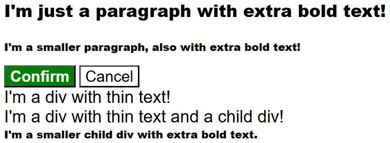

# The Cascade

Exercises focusing on specificity and rule order. Fix the elements that have some sort of specificity or rule order
issue in the provided CSS file

- Completed as part of the **CSS Foundations** section of the **Foundation Course** at
  [TheOdinProject](https://www.theodinproject.com).
- Taken from  the specified **css-exercises** repo; specifically the folder pertaining to
  [cascade](https://github.com/TheOdinProject/css-exercises/tree/main/foundations/cascade)

---

## Assignment Instructions

-  [01 - Cascade Fix &rArr;](./01-cascade-fix/)

## Results

<table>

<tr>
<td>

#### BEFORE

</td>
<td></td>
<td>

#### AFTER

</td>
</tr>

<tr>
<td width="47%">

</td>
<td width="6%" align="center">
<h1>&rArr;</h1>
</td>
<td width="47%">

</td>
</tr>

</table>
